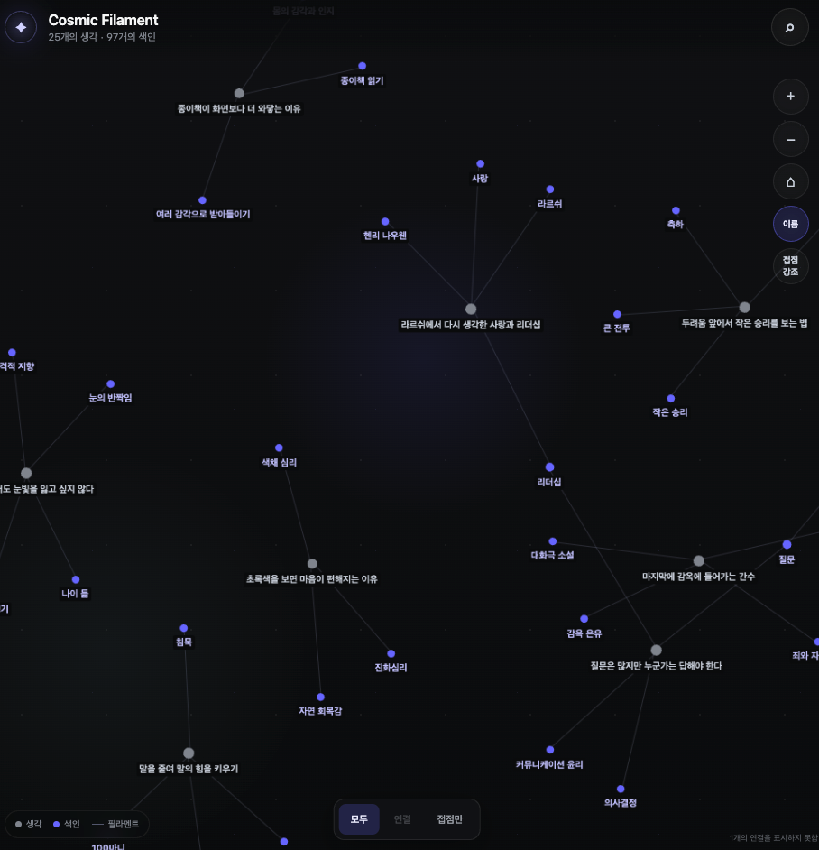

# Cosmic Filament

> 생각은 하나의 빛이고, 색인은 생각들이 이어지는 접점이다. 그 사이의 연결이 필라멘트를 이룬다.

**Cosmic Filament**는 색인된 생각과 그 사이의 연결을 그래프로 펼쳐 보여 주는 정적 웹 앱입니다. 앱이 새로운 의미를 추측해 연결하지는 않습니다. 두 생각이 이어져 있다면, 둘이 같은 색인을 공유하기 때문입니다.




_공개용 가상 데이터에서 여러 생각의 접점을 밝힌 화면입니다._

## 세계관

- **생각(Thought)** — 어둠 속에 놓인 하나의 빛
- **색인(Index)** — 여러 생각이 이어지는 접점
- **연결(Link)** — 생각과 색인 사이에 이어진 선
- **Cosmic Filament** — 생각, 색인, 연결이 함께 이루는 전체 구조
- **Little Light** — 이 우주를 다니며 관찰하고 기록하는 존재

이 세계관은 화면의 표현에만 쓰입니다. 데이터에 없는 관계를 AI가 임의로 만들지는 않습니다.

## 할 수 있는 일

- 노드를 끌어 움직이고 그래프를 확대하거나 축소하며 탐색
- **모두**: 모든 생각과 색인 보기
- **연결**: 선택한 생각이나 색인에서 두 단계 안에 있는 연결만 보기
- **접점만**: 둘 이상의 생각이 공유하는 색인과 그 생각만 보기
- **접점 강조**: 현재 화면은 그대로 두고, 여러 생각이 이어지는 접점과 연결을 밝게 표시
- **이름**: 모든 노드의 이름을 한꺼번에 표시하거나 숨기기
- 생각·색인 이름 검색
- 생각을 선택해 연결된 색인과 같은 색인을 공유하는 생각, 원문 경로 확인
- 모바일에서는 하단 시트, 데스크톱에서는 우측 패널로 상세 정보 표시

## 로컬 실행

```bash
npm ci
npm run dev
```

`http://localhost:5173/thoughts/`에서 공개용 샘플 데이터를 확인할 수 있습니다.

품질 확인:

```bash
npm test
npm run lint
npm run build
```

## 데이터 계약

앱은 `/thoughts/data/` 아래 세 파일을 읽습니다.

```text
thoughts.json  { "thoughts": [...] }
concepts.json  { "concepts": [...] }
links.json     { "edges": [...] }
```

최소 필드:

```json
{
  "thought": { "id": "thought-1", "title": "생각", "card_path": "cards/thought-1.md" },
  "concept": { "id": "concept-1", "name": "빛" },
  "edge": { "id": "edge-1", "source": "thought-1", "target": "concept-1", "type": "mentions" }
}
```

유효한 `thought → concept` 링크는 타입이나 확신도와 관계없이 기존 색인 결과대로 표시합니다. 존재하지 않는 source 또는 target을 가리키는 링크는 그래프에서 제외하고 개수만 알립니다.

`public/data/`와 `public/cards/`에는 공개용 **가상 데이터만** 둡니다. 실제 생각 원문과 색인 JSON, 인증 정보는 저장소나 이미지에 넣지 않습니다.

## 컨테이너

```bash
docker build -t cosmic-filament:dev .
docker run --rm -p 8080:8080 cosmic-filament:dev
curl http://localhost:8080/healthz
```

앱 경로는 `/thoughts/`, 상태 확인 경로는 `/healthz`입니다. 런타임 이미지는 unprivileged nginx를 사용합니다.

운영할 때는 앱 이미지와 개인 데이터를 분리합니다.

```text
public source + synthetic fixtures → container image
private Thought DB snapshot        → /thoughts/data + /thoughts/cards mount
shared ingress-nginx               → Service → Cosmic Filament nginx Pod
```

실제 데이터 디렉터리를 마운트하면 공개용 샘플 대신 개인 데이터가 표시됩니다. 인증은 HTML뿐 아니라 `/thoughts/data/`와 `/thoughts/cards/`에도 적용해야 합니다.

## 릴리스

`v*` 태그를 push하면 GitHub Actions가 테스트·린트·빌드를 통과한 뒤 멀티아키텍처 이미지를 GHCR에 게시합니다.

```text
ghcr.io/currenjin/cosmic-filament:<tag>
```

배포 저장소에서는 `latest` 대신 태그 또는 digest를 사용합니다.

## 저장소 경계

이 저장소에는 앱 소스, 가상 fixture, 스키마 계약, 테스트, Docker/nginx 설정만 둡니다. Kubernetes Deployment·Service·Ingress·인증 Secret과 개인 데이터 게시 과정은 비공개 운영 저장소에서 관리합니다.
